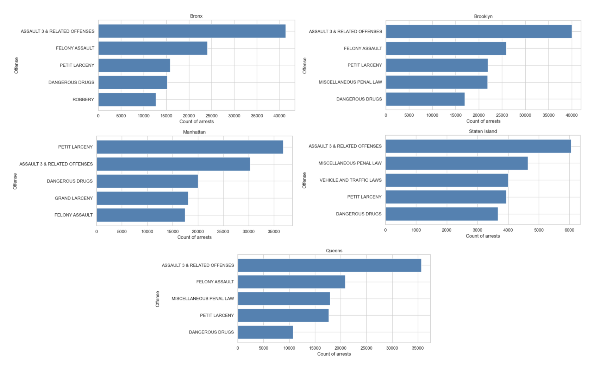
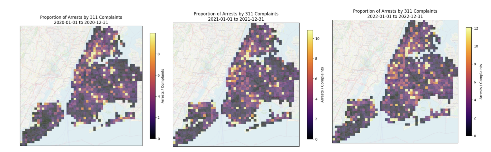
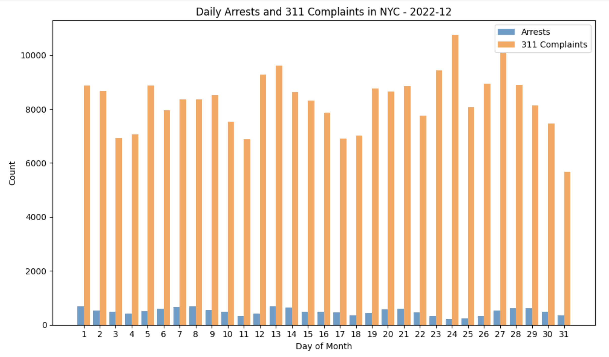

# New York City Complaints vs Arrests Analysis

This project analyzes how 311 service complaints relate to NYPD arrest activity across New York City between 2020 and 2024. By combining NYC Open Data on arrests with 311 Service Request records and zipcode-based geolocation, the project visualizes the ratio of arrests to complaints for a range of time across self-determined geo-grids to view patterns in complaints in an area and police responses.

## Data Source Overview:
### Dataset:
The arrests data comes from a public dataset, [New York Police Department Arrests Data](https://data.cityofnewyork.us/Public-Safety/NYPD-Arrests-Data-Historic-/8h9b-rp9u/about_data).

Relevant Dataset Features:
| Feature | Description | Sample Data| Data Type |
| :--- | :---: | :---: | :---: |
| ARREST_DATE | Date of the arrest | 12/31/24 | DATETIME |
| OFNS_DESC | Cause of Arrest | Felony Assault | VARCHAR |
| Latitude | Latitude at the point of the arrest | 40.687872 | DECIMAL(9,6) |
| Longitude | Longitude at the point of the arrest | -73.933032 | DECIMAL(9,6) |

The dataset contains records starting from 01-01-2020 till 12-31-2024.

#### Exploratory Data Analysis (EDA) and Dataset Summary:
* 973,069 total records over 1,827 days.
* 72 different arrest reasons.
* 16,218 arrests per month on average.
* 533 arrests per day on average.

These are the top 5 reasons for arrest by boroughs over 5 years (2020-2024):



ASSAULT 3 & RELATED OFFENSES seems to be the most frequent reason of arrest in all of the boroughs.

### API:
The complaints data comes from the "NYC 311 Service Requests" Endpoint of [City of New York API](https://data.cityofnewyork.us/resource/erm2-nwe9.json).
It provides us with a number of keys and values but the relevant keys were:
| Feature | Description | Sample Data| Data Type |
| :--- | :---: | :---: | :---: |
| created_date | Date of the complaint | 12/31/24 | DATETIME |
| latitude | Latitude at the point of the complaint | 40.74062402770654 | DECIMAL(17,14) |
| longitude | Longitude at the point of the complaint | -74.0077189043957 | DECIMAL(17,14) |

The API contains records till date. However, the records till 12-31-2024 have been used to compare with arrests data that is available.

## Objective:
* Visualize a heatmap of NYC in a grid showing the proportion of arrests made compared to the complaints in a range of time between 01-01-2020 to 12-21-2024 for each grid.

* Count of Arrests vs Complaints in NYC for each day of a month.

## Methods:
### Analysis 1:
* "get_311_points_range" function requests the API for all the complaint records for the specified date range with a limit of 50,000 records.
* "get_arrests_points_range" function gets all the arrests records for the specified date range from the dataset.
* "plot_grid_range" function counts the records from the above mentioned functions and calculates the proportion of arrests/complaints for the date range and plots it on a grid superimposed over a map of NYC. The number of cells in the grid is defined by a user supplied parameter called "bins".

#### Workflow:
* Dates in the dataset are in the format "%m/%d/%Y" and dates from the API are in the format "%Y-%m-%d". For consistency and comparison, they were converted to the same format using the datetime library.
* "get_311_points_range" returns the latitude and longitude of the complaints records of the supplied date range in an array.
* "get_arrests_points_range" returns the latitude and longitude of the arrests records of the supplied date range in an array.
* "plot_grid_range" calculates the length of the arrays to determine the counts of the records, calculate the proportions and plots using cartopy and matplotlib libraries.

### Analysis 2:
* "plot_daily_counts_for_month" plots a histogram showing the counts of arrests vs complaints for each day of a supplied month of a year between 01-2020 to 12-2024. "days_in_month" function calculates the total number of days in the given month to show accurate number of days in the histogram.

#### Workflow:
* Similar to analysis 1, "plot_daily" function calculates the length of records for each day of a month which determines the number of records for that day. It takes a year and a month parameter and returns a histogram.

## Results:
The function "plot_grid" when supplied with the dataset name, a date and number of bins returns a New York City plot superimposed with a grid of proportions (Counts of Arrests / Counts of Complaints).

### Unit Test (Analysis 1):
Below are the plots for the first three years of the dataset. There seems to be a consistent high proportion of arrests/complaints in the Manhattan Borough and consistently low in Staten Island.
```
csv_file = "NYPD_Arrests_Data.csv"
plot_grid_range(csv_file, "2020-01-01", "2020-12-31", bins=50)
plot_grid_range(csv_file, "2021-01-01", "2021-12-31", bins=50)
plot_grid_range(csv_file, "2022-01-01", "2022-12-31", bins=50)

```


  
Additionally, the function "plot_daily" when supplied with the dataset name, the year and the month returns a histogram from day 1 to the last day iof the month comparing the number of arrests and complaints for each day of the month.

### Unit Test (Analysis 2):
```
plot_daily("NYPD_Arrests_Data.csv", year=2022, month=12)
```


For this particular example (December 2022), there seems to be a clear trend of more complaints as well as more arrests during the weekdays and fewer during the weekends.

## Conclusion:
The analysis shows that 311 complaints and NYPD arrests are not spread evenly across New York City, either over time or across space. By mapping arrests and complaints onto geographic grids, it was found that Manhattan and parts of the Bronx and Brooklyn tend to have higher arrest-to-complaint ratios, while Staten Island consistently shows lower ratios. Looking at daily counts for a particular example also shows that arrests are generally higher during the weekdays compared to the weekends.
